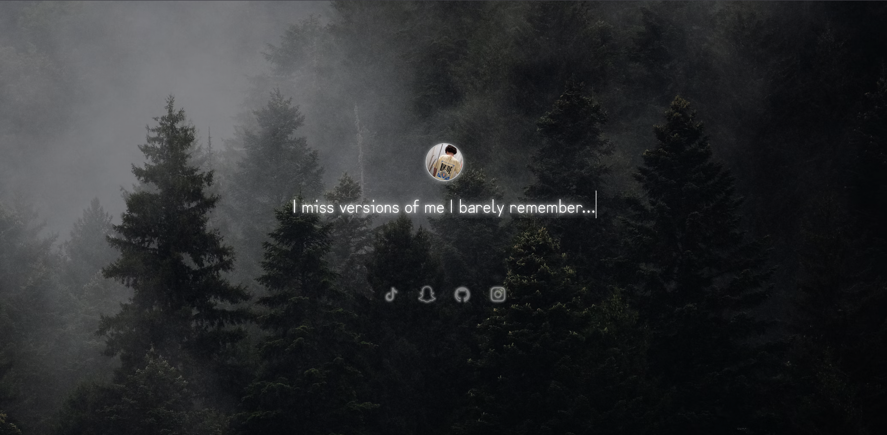

# Bio Page with Typewriter Effect

This repository contains a customizable bio page template built with HTML, CSS, and JavaScript. It features:

- Profile picture display
- Up to 6 custom sentences with a typewriter effect
- Custom background wallpaper
- Optional background audio
- Social media links with icons

## Features

- Easy to customize text, images, and links
- Responsive design
- Smooth typewriter animation for bio sentences
- Overlay for better readability on backgrounds

## Screenshot

## Usage

1. Replace placeholders (e.g., `YOUR CUSTOM URL HERE`) with your own content in the HTML file.
2. Customize your sentences in the JavaScript section.
3. Add your own images and audio files to the project folder.
4. Upload to GitHub Pages or any web host.

## License & Terms

All rights reserved by Wic (WhatIsCrypto).  
You **may not** sell, redistribute, or claim this code as your own.  
For more information, visit [https://urus.lol/legal.html](https://urus.lol/legal.html).

---

Made by Wic (urus.lol)
